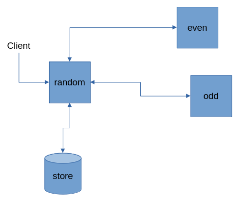
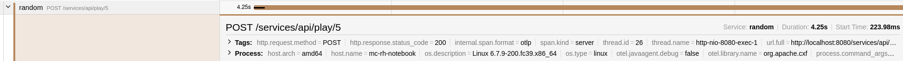

== Spring Boot Example with Camel exposing REST services using Apache CXF, collecting distributed tracing using OpenTelemetry

=== Introduction

This example illustrates how to use https://projects.spring.io/spring-boot/[Spring Boot] with http://camel.apache.org[Camel]. It provides a simple REST service that is created using https://cxf.apache.org/[Apache CXF] and how it is possible to generate Spans using https://cxf.apache.org/docs/using-opentelemetry.html[OpenTelemetry].

There are 3 services communicating each other, starting from the `random` service

- random : the main service, exposes the entry point REST service and store the results
- even : the service that verifies the even numbers
- odd : the service that verifies the odd numbers

moreover there is a common module containing common classes

=== Build

You can build this example using, it will also download the OpenTelemetry agent used to instrumenting the applications:

    $ mvn package -Potel-agent

=== Run

Run infra services using:

    $ docker-compose -f containers/docker-compose.yml up -d

the command runs :

- https://github.com/minio/minio[minio] as application storage
- https://github.com/open-telemetry/opentelemetry-collector[opentelemetry-collector] to receive the generated Trace/Span
- https://github.com/jaegertracing/jaeger[Jaeger] to visualize the traces

Run services on separated terminals:

    $ source containers/env.sh \
        && java -javaagent:target/opentelemetry-javaagent.jar \
        -Dotel.service.name=random \
        -jar rest-cxf-otel-random/target/*.jar

    $ source containers/env.sh \
        && java -javaagent:target/opentelemetry-javaagent.jar \
        -Dotel.service.name=even \
        -Dserver.port=8081 \
        -jar rest-cxf-otel-even/target/*.jar

    $ source containers/env.sh \
        && java -javaagent:target/opentelemetry-javaagent.jar \
        -Dotel.service.name=odd \
        -Dserver.port=8082 \
        -jar rest-cxf-otel-odd/target/*.jar

After the Spring Boot application is started, you can open the following URL in your web browser to access the list of services: http://localhost:8080/services/ including WADL definition

You can also access the REST endpoint from the command line:

Generate 5 random numbers
[source,text]
----
$ curl -X POST http://localhost:8080/services/api/play/5 -s | jq .
----

The command will produce an output like:

[source,json]
----
{
  "result": {
    "ODD": [
      {
        "number": 229,
        "type": "ODD"
      },
      {
        "number": 585,
        "type": "ODD"
      }
    ],
    "EVEN": [
      {
        "number": 648,
        "type": "EVEN"
      },
      {
        "number": 670,
        "type": "EVEN"
      },
      {
        "number": 846,
        "type": "EVEN"
      }
    ]
  },
  "evenCount": 3,
  "oddCount": 2
}
----

In the Jaeger UI http://localhost:16686 the traces will be available, also from CXF instrumentation

The services can be stopped pressing `[CTRL] + [C]` in the shell, and the containers can be stopped with

    $ docker-compose -f containers/docker-compose.yml down

=== Help and contributions

If you hit any problem using Camel or have some feedback, then please
https://camel.apache.org/community/support/[let us know].

We also love contributors, so
https://camel.apache.org/community/contributing/[get involved] :-)

The Camel riders!
